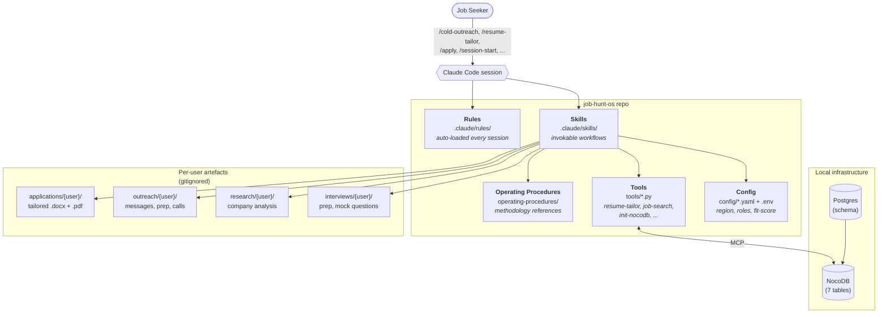

# job-hunt-os

**An agentic job-hunt operating system for [Claude Code](https://docs.claude.com/en/docs/claude-code) (or any compatible AI-agent tool).**

[](LICENSE)
[](https://github.com/alexmonegrop/job-hunt-os/generate)
[](https://www.python.org/)
[](https://www.nocodb.com/)
[](https://docs.claude.com/en/docs/claude-code)
[](https://github.com/alexmonegrop/job-hunt-os/releases)

Fork this template, plug in your resume, and run a structured pipeline of cold outreach, networking follow-ups, job discovery, resume tailoring, and application tracking — all coordinated by an AI agent that auto-loads the same rules every session.

> **Status:** v1 template complete. See the [`CHANGELOG`](CHANGELOG.md) and [`docs/PLAN.md`](docs/PLAN.md) for milestone history.
>
> **AI agents picking up this repo:** read [`AGENTS.md`](AGENTS.md) first. It's the canonical onboarding doc for the AI operator.

---

## Table of contents

- [Why this exists](#why-this-exists)
- [What you get](#what-you-get)
- [Architecture](#architecture)
- [Quickstart](#quickstart)
- [Documentation](#documentation)
- [Who this is for](#who-this-is-for)
- [Contributing](#contributing)
- [Origin & license](#origin--license)

---

## Why this exists

A serious job hunt is a pipeline, not a stack of one-off applications: 30+ target companies, 200+ networking contacts, 50+ tailored resumes, dozens of meetings, follow-ups, and interview prep cycles — all running in parallel for weeks or months.

Most job seekers hold this in spreadsheets and notes apps and lose track. AI agents *should* be ideal for the coordination problem, but most chat-based agents are amnesiac and ad-hoc.

This template is the opposite: a **rule-driven, multi-skill agentic system** where the same standards (database hygiene, message-quality bar, contact-selection logic, fit-scoring, file naming) auto-load every session, the same skills (`/cold-outreach`, `/job-search`, `/resume-tailor`, `/apply`, `/meeting-prep`…) compose into the same workflow, and the same database holds every artefact across months. Configurable per region, role, and industry — same agent, any market.

---

## What you get

- **Auto-loaded rules** ([`.claude/rules/`](.claude/rules/)) — 9 rule files defining database hygiene, message quality, batch operations, contact selection, file organisation, application protocol, and resume tailoring. The agent follows these without being asked.
- **Invokable skills** ([`.claude/skills/`](.claude/skills/)) — 13 slash commands:
  - `/cold-outreach` · `/contact-population` · `/meeting-prep` · `/company-deep-dive` · `/warm-followup`
  - `/job-search` · `/resume-tailor` · `/apply` · `/application-tracker`
  - `/onboard-user` · `/session-start` · `/session-checkpoint` · `/session-end`
- **Operating procedures** ([`operating-procedures/`](operating-procedures/)) — 9 long-form methodology docs covering outreach v4, meeting prep v4, resume tailoring, direct application, contact population, insight development, message examples, application-speed lessons, and video-transcription analysis.
- **Configurable everything** ([`config/*.yaml`](config/)) — your region, target roles, industries, fit-score weights, and excluded companies live in YAML.
- **Demo user "Jane Demo"** with a full fictional dataset and end-to-end walkthrough at [`plans/EXAMPLES/jane-demo-walkthrough.md`](plans/EXAMPLES/jane-demo-walkthrough.md).
- **Reference templates** for the master-experience YAML and cover letters.
- **Tools** ([`tools/`](tools/)) — Python CLIs for resume tailoring with quality gate + recruiter-review LLM, JobSpy job discovery, mock-interview LLM, NocoDB schema init with `--auto-bootstrap`, and onboarding.
- **Infrastructure** ([`infrastructure/`](infrastructure/)) — Docker Compose stack for self-hosted NocoDB + Postgres (Caddy reverse proxy as an opt-in profile), with seed schema.
- **Employer-extension example** ([`tools/employer-extension-example/`](tools/employer-extension-example/)) — a documented pattern for extending the system per-employer.

---

## Architecture



**One-paragraph version**: Rules ([`.claude/rules/`](.claude/rules/)) auto-load at session start and define non-negotiable standards. Skills ([`.claude/skills/`](.claude/skills/)) are invokable workflows. Operating procedures ([`operating-procedures/`](operating-procedures/)) are long-form methodology references the skills point to. Tools ([`tools/`](tools/)) are CLI utilities the skills shell out to. Configuration ([`config/*.yaml`](config/) + `.env`) holds your region, target roles, fit-score weighting, industry vocabulary, and credentials. Data lives in NocoDB by default; per-user content lives under `applications/{slug}/`, `interviews/{slug}/`, `outreach/{slug}/`, `research/{slug}/`, all gitignored at the user level. Full details: [`docs/ARCHITECTURE.md`](docs/ARCHITECTURE.md).

---

## Quickstart

```bash
# 1. Use this template (or git clone)
gh repo create my-job-hunt --template alexmonegrop/job-hunt-os --private
cd my-job-hunt

# 2. Bring up the data backend
cd infrastructure
cp .env.example .env                                    # set POSTGRES_PASSWORD
docker compose up -d                                    # postgres + nocodb
cd ..

# 3. One-shot init: signs up admin via API, mints a PAT, discovers the base + link fields
cp .env.example .env                                    # then edit NOCODB_URL if non-default
python tools/setup/init-nocodb.py --auto-bootstrap

# 4. Customise config to your region / industries / roles
cp config/user-profile.example.yaml config/user-profile.yaml
cp config/fit-score.example.yaml    config/fit-score.yaml
cp config/industries.example.yaml   config/industries.yaml
cp config/regions.example.yaml      config/regions.yaml
$EDITOR config/user-profile.yaml                        # edit each to match your situation

# 5. Set the active user in .env (e.g., JOB_HUNT_USER=alice)

# 6. Open in Claude Code and run /onboard-user — the agent does the rest
claude
> /onboard-user
```

Full walkthrough: [`docs/SETUP.md`](docs/SETUP.md). MCP wiring (NocoDB + Context7 + Playwright): [`docs/SETUP.md` Step 6](docs/SETUP.md). Customisation: [`docs/CUSTOMIZE.md`](docs/CUSTOMIZE.md). End-to-end example with Jane Demo: [`docs/EXAMPLES.md`](docs/EXAMPLES.md).

---

## Documentation

| Doc | What it covers |
|-----|----------------|
| [`docs/SETUP.md`](docs/SETUP.md) | Step-by-step install: prerequisites, Docker stack, NocoDB bootstrap, MCP servers, troubleshooting |
| [`docs/CUSTOMIZE.md`](docs/CUSTOMIZE.md) | Filling in `config/*.yaml`, choosing fit-score weights, defining target roles |
| [`docs/ARCHITECTURE.md`](docs/ARCHITECTURE.md) | How rules, skills, procedures, tools, and data fit together |
| [`docs/EXAMPLES.md`](docs/EXAMPLES.md) | End-to-end walkthrough using the bundled `jane-demo` fictional user |
| [`docs/EXTEND.md`](docs/EXTEND.md) | Adding new rules / skills / tools, the employer-extension pattern, fork-vs-PR decision |
| [`docs/MULTI-USER.md`](docs/MULTI-USER.md) | Running the system for multiple applicants from one repo |
| [`docs/CONTRIBUTING.md`](docs/CONTRIBUTING.md) | PR conventions, commit style, the forbidden-token grep |
| [`docs/PLAN.md`](docs/PLAN.md) | Multi-phase rollout history (M1 → M14) — useful for fork maintainers |
| [`docs/MIGRATION-FROM-PRIVATE-FORK.md`](docs/MIGRATION-FROM-PRIVATE-FORK.md) | If you have a private fork, how to keep it in sync |
| [`AGENTS.md`](AGENTS.md) | First read for AI agents operating the pipeline |
| [`CLAUDE.md`](CLAUDE.md) | Claude Code project instructions (auto-loaded for repo maintenance) |
| [`SECURITY.md`](SECURITY.md) | Vulnerability disclosure and secrets-handling guidance |
| [`CHANGELOG.md`](CHANGELOG.md) | User-visible changes per release |

---

## Who this is for

- **Job seekers** comfortable with Docker + Python + Claude Code (or a compatible MCP-aware agent), who want a pipeline-driven hunt instead of ad-hoc applications.
- **AI / dev-tool tinkerers** who want a working example of a multi-skill, rule-driven agentic system — outreach, search, application, interview prep all sharing the same database and the same auto-loaded conventions.
- **Career coaches / consultants** running structured hunts for multiple people. Multi-user is built in (see [`docs/MULTI-USER.md`](docs/MULTI-USER.md)).

If you don't run Docker locally and don't want to: NocoDB has a [free cloud tier](https://nocodb.com/) the schema can be loaded into. Or replace NocoDB entirely — see [`docs/EXTEND.md`](docs/EXTEND.md).

---

## Contributing

PRs welcome. The system is opinionated by design; if your workflow diverges, fork freely.

- Read [`docs/CONTRIBUTING.md`](docs/CONTRIBUTING.md) before opening a PR.
- File bugs via the [bug-report template](.github/ISSUE_TEMPLATE/bug_report.yml).
- Propose new rules / skills / tools via the [feature-request template](.github/ISSUE_TEMPLATE/feature_request.yml).
- Security issues → please use a [private GitHub Security Advisory](https://github.com/alexmonegrop/job-hunt-os/security/advisories/new) ([`SECURITY.md`](SECURITY.md)).

---

## Origin & license

Extracted from a real, working private job-hunt repo that ran a successful 12-month pipeline (~110 applications, ~500 networked contacts, multiple offers received, one role accepted). The public template strips all personal data, contact lists, message archives, and employer-specific artefacts; only the methodology, tooling structure, and rules remain.

License: [MIT](LICENSE). Use, fork, modify, redistribute. No warranty.
